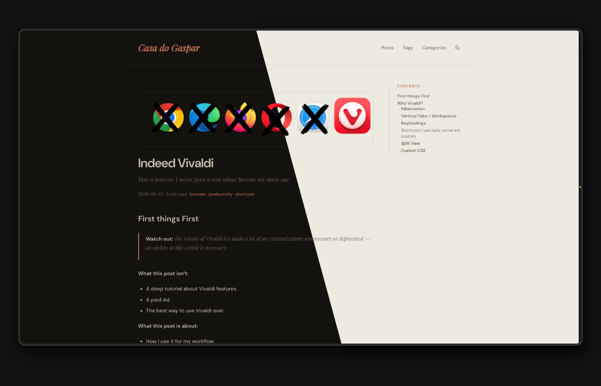

# hugo-theme-casadogaspar

A warm, editorial Hugo theme. Clean typography, minimal chrome, sticky table of contents, dark mode with a toggle, and image lightbox out of the box.

**Font pairing:** Playfair Display (serif, titles + italic accents) · DM Sans (body) · JetBrains Mono (code)  
**Requires:** Hugo v0.128.0+ (extended not required)



---

## Installation

### As a git submodule (recommended)

```bash
git submodule add https://github.com/gaspar-d/hugo-theme-casadogaspar themes/hugo-theme-casadogaspar
```

Then set the theme in your `hugo.toml`:

```toml
theme = "hugo-theme-casadogaspar"
```

### Local copy

Copy the theme folder into `themes/hugo-theme-casadogaspar/` and set `theme` in `hugo.toml` as above.

---

## Minimal hugo.toml

```toml
baseURL   = "https://example.com/"
locale    = "en"
title     = "My Blog"
theme     = "hugo-theme-casadogaspar"

[params]
description = "A line about your blog."
author      = "Your Name"
dateFormat  = "2006-01-02"

[params.social]
github  = "your-github-handle"
youtube = "https://www.youtube.com/@yourchannel"  # full URL

[menu]
[[menu.main]]
identifier = "posts"
name       = "Posts"
url        = "/posts/"
weight     = 1
[[menu.main]]
identifier = "tags"
name       = "Tags"
url        = "/tags/"
weight     = 2
[[menu.main]]
identifier = "categories"
name       = "Categories"
url        = "/categories/"
weight     = 3

[markup.highlight]
noClasses = false

[markup.goldmark.extensions.extras.mark]
enable = true

[taxonomies]
tag      = "tags"
category = "categories"

[outputs]
home = ["HTML", "RSS"]
```

---

## Customising colors

All colors are CSS custom properties in `assets/css/main.css`. Override them in your own site by creating `assets/css/custom.css` and adding it to your `hugo.toml`, or by forking the theme.

### Light mode tokens

| Property | Default | Role |
|---|---|---|
| `--color-bg` | `#edeae0` | Page background (warm parchment) |
| `--color-surface` | `#f4f1e8` | Code blocks, ToC background |
| `--color-border` | `#d9d2c2` | Dividers, borders |
| `--color-text` | `#1c1a17` | Body text |
| `--color-muted` | `#7a7060` | Dates, captions, nav links |
| `--color-accent` | `#c4725a` | Terracotta — titles, italic emphasis, active ToC, highlight tint |
| `--color-code-bg` | `#e4dfd3` | Inline code background |

### Dark mode tokens

Dark mode activates via `[data-theme="dark"]` on `<html>` (set by the toggle button or on load from `localStorage`).

| Property | Default dark value |
|---|---|
| `--color-bg` | `#131210` |
| `--color-surface` | `#1c1a17` |
| `--color-border` | `#2a2620` |
| `--color-text` | `#c0b8a8` |
| `--color-muted` | `#6a6050` |
| `--color-accent` | `#c4725a` (unchanged) |
| `--color-code-bg` | `#191714` |

### Example: swap the accent to blue

```css
/* assets/css/custom.css */
:root {
  --color-accent: #4a7fa5;
}
```

---

## Customising fonts

Fonts are loaded from Google Fonts in `layouts/_default/baseof.html`. To change them, override the template or fork the theme and edit the `<link>` tag and the three font variables:

```css
:root {
  --font-serif: 'Your Serif Font', Georgia, serif;
  --font-sans:  'Your Sans Font', system-ui, sans-serif;
  --font-mono:  'Your Mono Font', monospace;
}
```

The `--font-serif` is used for:
- Site title (nav)
- Italic emphasis (`*word*`) — rendered in the accent color
- Post description / subtitle
- Blockquotes

The `--font-sans` is used for everything else (body, headings, nav links, metadata).

---

## Post front matter

```yaml
---
title: Post Title
date: 2026-01-01
draft: false            # true = never publishes
author:
  name: Your Name
description: "One sentence — shown in the post list and used as meta description."
featuredImage: "cover.png"   # optional, co-located with index.md
tags:
  - tag-one
categories:
  - Category
---
```

`featuredImage` is optional. If omitted, the post renders without a cover image.

---

## Content structure

Posts are **page bundles** — a folder containing `index.md` and any co-located assets (images, etc.):

```
content/posts/
  my-first-post/
    index.md
    cover.png
    diagram.svg
```

Reference images by filename only — no path needed:

```markdown

```

---

## Features

| Feature | Notes |
|---|---|
| Dark mode | Toggle in nav, saved to `localStorage`, no flash on load |
| Table of contents | Right sidebar, sticky, visible above 1100px, active heading highlighted on scroll |
| Image lightbox | Click any image to expand fullscreen, click or `Escape` to close |
| Code copy button | Appears on hover over any code block |
| Syntax highlighting | Chroma CSS classes, warm palette for light and dark |
| `==highlight==` | Inline text highlight via `<mark>`, requires `markup.goldmark.extensions.extras.mark.enable = true` |
| Footnotes | Native Goldmark support |
| Task lists | `- [x]` / `- [ ]` checkboxes |
| RSS | Auto-generated at `/index.xml` |

---

## License

[MIT](LICENSE) — free to use, modify, and distribute, with or without attribution. See the `LICENSE` file for the full text.
